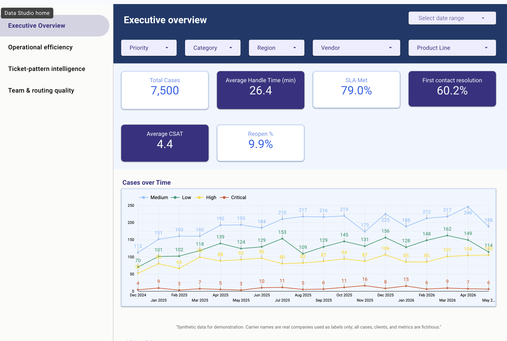
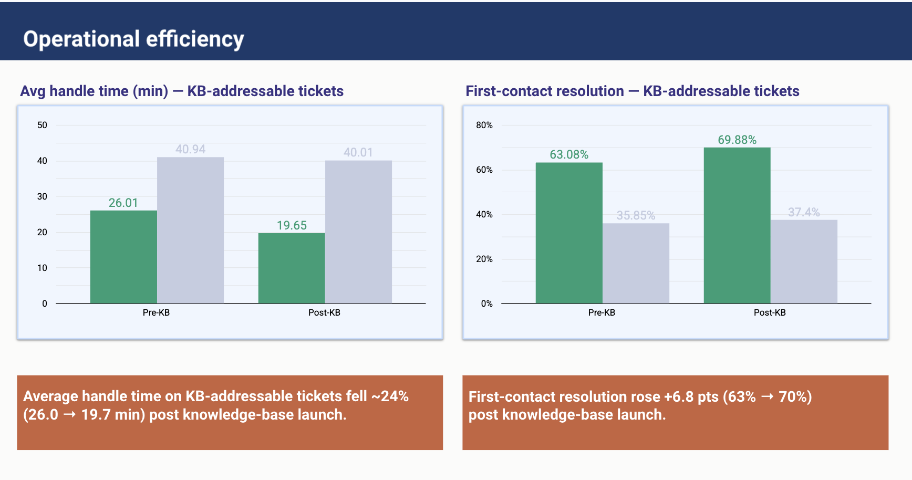
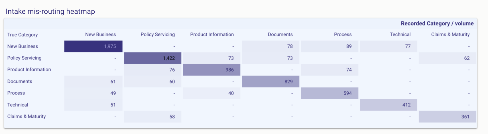
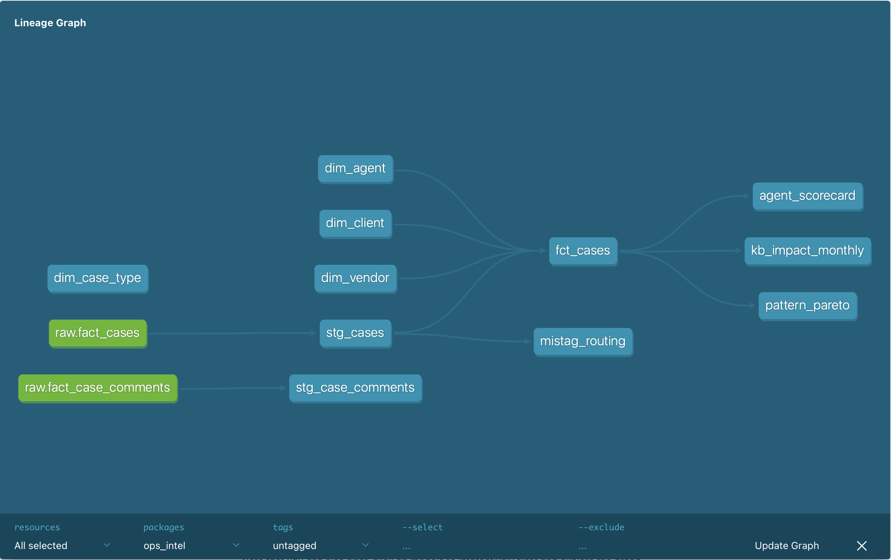

# Operations Productivity Intelligence

Synthetic **Salesforce-style Case data** for a Client Services / Operations team that
supports financial advisors selling **life insurance & annuity** products across
multiple carriers. It reconstructs the kind of ops-analytics engagement that drives
real efficiency wins — surfacing the most common ticket patterns with ML + LLM
analysis, standing up a knowledge base, and **measuring** the lift end-to-end rather
than asserting it.

> **Headline (measured from the data, shown in the dashboard):** average handle time
> on knowledge-base-addressable tickets fell **24% (26.0 → 19.7 min)** in the 6 months
> after the KB launch — every figure traceable to the generated data.

**Stack:** Salesforce (source shape) → CSV/ELT → **BigQuery** → **dbt** → **Data Studio**, with a **Python + LLM** layer for ticket-pattern mining and KB drafting.

> ⚠️ **100% synthetic.** Carrier names are real companies used only as realistic
> labels. All clients, advisors, agents, cases, messages, dollar amounts and
> metrics are fictitious and represent no real person or company.

**Start here:** [Live dashboard](https://datastudio.google.com/s/g6Y--JQTi6E) · [Decision brief](DECISION_BRIEF.md) (what leadership should do) · [Metrics dictionary](METRICS.md) (the KPI single source of truth)

---

## Quick start

```bash
python3 -m venv .venv && source .venv/bin/activate
pip install -r requirements.txt

python simulate_ops_data.py        # 1. generate the dataset → data/*.csv
python analyze_patterns.py         # 2. rank ticket patterns → KB backlog (out/*.csv)
python ml_patterns.py              # 3. unsupervised discovery + ARI validation
python ml_classify.py              # 4. triage bake-off (classic ML; add --claude for the LLM)
# 5. (optional) warehouse + Data Studio path:
gcloud auth application-default login
export BQ_PROJECT=mallpulse-hackathon BQ_DATASET=ops_intel
python load_bigquery.py             #    EL: land raw fact tables in BigQuery
cd dbt && dbt seed && dbt build     #    dbt: seed dims, build staging+marts, run tests
dbt docs generate && dbt docs serve #    lineage DAG (great portfolio screenshot)
#    then assemble the dashboard on the marts → see DATA_STUDIO_GUIDE.md

# Claude tiers (need ANTHROPIC_API_KEY):
export ANTHROPIC_API_KEY=...
python ml_classify.py --claude --draft   # head-to-head + sample drafted replies
python analyze_patterns.py --llm         # draft KB articles → out/kb_articles.md
```

## What gets generated

| File | Grain | Rows | Notes |
|------|-------|------|-------|
| `data/dim_vendor.csv` | carrier | 12 | Pacific Life, Lincoln, Athene, … + product lines & portal |
| `data/dim_agent.csv` | ops team member | 8 | role, specialization, seniority |
| `data/dim_client.csv` | advisory firm (SF Account) | 120 | type, segment, region, book size |
| `data/dim_case_type.csv` | ticket taxonomy | 28 | category/subcategory, SLA, FCR & reopen baselines, `kb_addressable` |
| `data/fact_cases.csv` | **case** (SF Case) | **7,500** | the core table — see columns below |
| `data/fact_case_comments.csv` | message | ~15,000 | threaded client ↔ agent messages |

### `fact_cases` columns (Salesforce Case ↔ analytics)

- **Identity / routing:** `case_id`, `case_number`, `client_id`, `contact_name`,
  `owner_agent_id`, `vendor_id`, `product_line`, `product_type`
- **Classification:** `case_type_id`, `category` (true intent), `category_tagged`
  (recorded at intake — carries ~12% mis-tag noise), `is_mistagged`, `subcategory`,
  `subject`, `reason_code`, `priority`, `origin` (Email/Phone/Web Portal/Chat), `status`
- **Free text (for LLM):** `description` (client's inbound message),
  `resolution_summary`, `csat_comment`
- **Time / productivity:** `created_date`, `first_response_at`, `closed_date`,
  `first_response_minutes`, **`handle_time_minutes`** (active touch time),
  `resolution_time_hours` (created→closed, business hours)
- **Quality:** `reopened_count`, `escalated`, `sla_target_hours`, `sla_met`,
  `is_first_contact_resolution`, `csat_score` (1–5), `kb_addressable`

### Star schema

```
                 dim_vendor ─┐
dim_client ──────────────────┤
dim_agent  ──── fact_cases ──┼──── dim_case_type
                             └──── fact_case_comments (via case_number)
```

## The 28 case types (ticket taxonomy)

Across 7 categories, modeled on a real annuity/life ops desk:

- **Product Information** — features/riders, rates & crediting, cross-vendor comparison, suitability/illustration
- **New Business** — application help, **NIGO (not-in-good-order)**, e-signature, portal submission, status check, underwriting
- **Documents** — forms list, wrong form version, upload failure, 1035 exchange paperwork
- **Policy Servicing** — beneficiary change, contact update, billing, cash value, loan/withdrawal, **annuity annual-growth question**
- **Process** — commission, carrier appointment/licensing, general how-to
- **Claims & Maturity** — death claim, annuitization/maturity, surrender
- **Technical** — portal access, book-of-business data request

## The ↑24% efficiency story (built into the data)

A **knowledge-base program launches 2025-09-01** (`KB_LAUNCH`). After launch, the
KB-addressable case types show progressively lower handle time & first-response,
higher first-contact resolution, and fewer reopens. The generator prints the
realized lift — **~24% lower handle time** on KB-addressable cases post-launch
(26.0 → 19.7 min) — a clean before/after for a Data Studio time-series.

> **Honest framing:** this number is *measured from the data*, not asserted.
> Quote it as "average handle time on KB-addressable tickets fell 24% over the
> 6 months after the KB launch," and show the chart — don't stack invented
> percentages for the ML and LLM layers on top of it.

## Dashboard (Data Studio)

**Live report:** https://datastudio.google.com/s/g6Y--JQTi6E — 4 pages, built directly on the dbt marts.

### Executive overview


KPI scorecards (**7,500** cases · **26.4** min avg handle · **79.0%** SLA met · **60.2%**
first-contact resolution · **4.4** CSAT · **9.9%** reopen), case volume over time by
priority, and page filters for priority / category / region / vendor / product line.

### Operational efficiency — the ↑24%


Pre/post-KB handle time (**26.0 → 19.7 min, −24%**) and first-contact resolution
(**63% → 70%, +6.8 pts**) on KB-addressable tickets — each shown against a **flat
control group** (non-KB-addressable: ~41 → 40 min, ~36% → 37% FCR), so the gain is
attributable to the knowledge base, not a general efficiency trend.

### Team & routing quality — intake mis-routing


True vs. recorded category. The diagonal dominates; **~12% of tickets are routed to the
wrong queue at intake** (adjacent-category confusion, e.g. NIGO ↔ Documents) — the exact
problem the triage bake-off (Tier 2) targets.

### Warehouse lineage (dbt)


dimension **seeds** + fact **sources** → staging → marts, with data tests and generated docs.

*(Two more pages not shown: **Ticket-pattern intelligence** — Pareto of volume by case
type + a cost-vs-fixability bubble; and the rest of **Team & routing** — agent scorecard
with conditional formatting and SLA & handle-time by category. Build steps: `DATA_STUDIO_GUIDE.md`.)*

## The analysis layers (the portfolio substance)

Three tiers, **no stacked invented numbers** — each result is measured.

### Tier 1 — Classic ML (the Signal Advisors-style work)

- **`analyze_patterns.py`** — ranks case types by a *KB-opportunity score*
  (volume × handle time × (1−FCR) × reopens) → `out/ticket_patterns.csv` and a
  prioritized `out/kb_backlog.csv` with estimated deflectable agent-hours/month.
- **`ml_patterns.py`** — *unsupervised* pattern discovery, honestly validated:
  TF-IDF → KMeans on raw client messages (no labels), scored against ground
  truth. Recovers the taxonomy at **ARI ≈ 0.58 / NMI ≈ 0.85**, **84% category
  accuracy**, with NMF themes per cluster. Proves the patterns are real
  structure, not artifacts of the generator. Curated domain stop-list strips
  carrier names + intake boilerplate so clusters key on the *issue*.

### Tier 2 — Triage bake-off: classic ML vs. Claude (`ml_classify.py`)

The centerpiece. Same task — route a message to 1 of 7 ops queues — scored two
ways against ground truth that carries **~12% realistic intake-tag noise**:

- **TF-IDF + Logistic Regression** (trains on 6k examples): macro-F1 **0.855**.
- **Claude zero-shot** (no training data): macro-F1 **0.833**.
- On the 150-ticket head-to-head, the classifier edges Claude (**0.865 vs 0.833**) and
  recovers the *true* queue on intake-mislabeled tickets **94.7%** vs Claude's **84.2%**.

The takeaway is **judgment, not "the LLM wins"**: for a high-volume, well-defined task
with labeled history, a $0 classifier beats a per-call LLM — so route triage to the cheap
model and reserve Claude for the zero-training-data cold start, KB drafting, and reply
assist (Tier 3).

### Tier 3 — Claude assist

- **`ml_classify.py --draft`** — Claude drafts first-response replies for sample
  tickets (`out/draft_replies.md`). A demo of the assist layer, not a metric claim.
- **`analyze_patterns.py --llm`** — Claude drafts self-serve KB articles for the
  top patterns from representative client messages (`out/kb_articles.md`); falls
  back to a deterministic template when no key is set, so the pipeline always runs.

```bash
export ANTHROPIC_API_KEY=...
# optional cheaper model for the high-volume classification:
export OPS_LLM_MODEL=claude-haiku-4-5   # default is claude-opus-4-8
python ml_classify.py --claude --sample 150 --draft
```

## Reproducibility

Seeded (`random`/`numpy` seed = 7) — every run produces the same dataset.
Tunables at the top of `simulate_ops_data.py`: `N_CASES`, `START`/`END`,
`KB_LAUNCH`, team roster, client count, and the case-type catalog.
